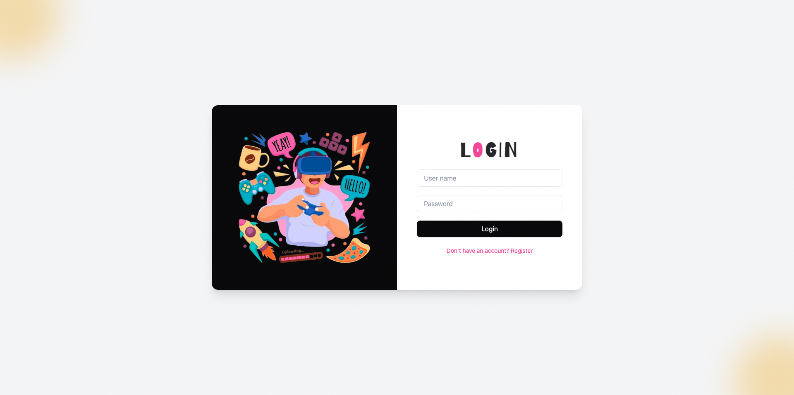
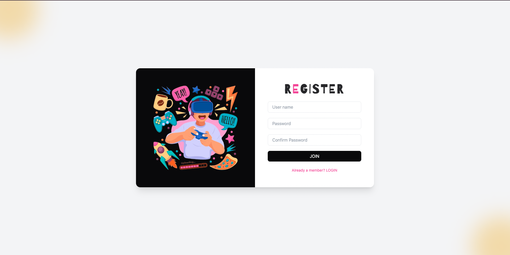

# 🎮 QR Login Module
(Main branch)

A playful, game-inspired login interface that redirects to a **QR Code** page after successful login. Built with **React**, **Tailwind CSS**, and **React Router**.

## ✨ Features

- Fun gaming-themed design with custom fonts
- Login form 
- Redirects to a dynamically generated QR code page
- Responsive and modern UI using Tailwind CSS
- Social login icons (Facebook & Google placeholders)

## 📸 Preview





## 🚀 Getting Started

### 1. Clone the repo

```bash
git clone https://github.com/revathipriyan/qr-module.git
cd qr-module
